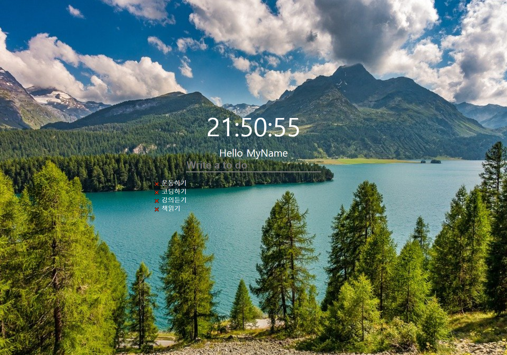

# Project
### clone-vanillaJs-todoList
- 바닐라스크립트로 구현한 todoList  
강의를 바탕으로 간단한 기능 추가   
requirements 참고  

# Demo
[clone-vanillaJs-todoList 사이트 이동](https://leedokchidok19.github.io/clone-vanillaJs-todoList/)

### Design
##### Preview

    </img>

   
##### Requirements
+ Single Page Application(SPA)
+ Clock
+ Weather API
+ Todo
+ localstorage
+ Text Read
---
### Improvements
+ 단축키 목록 불러오기 (Brackets tool)
    - 사용자 입력 X, 지정된 단축키 목록 불러오기
+ 날씨 API on/off 기능 추가
+ todo 목록 입력시 오늘 날짜 추가
    - on/off 기능
+ todo 목록 표기 방식 지정
    - 리스트 형식(등록순으로 정렬)
    - 날짜별 구분
+ json 형식으로 export 기능 추가
    - todo 목록
    - todo 환경 설정
---
# Reference
+ [nomadcoders](https://nomadcoders.co/)

# API
+ [OpenWeatherMap](https://openweathermap.org/)
+ [공공데이터포털](https://www.data.go.kr/tcs/dss/selectApiDataDetailView.do?publicDataPk=15084084)

# Tool
+ Brackets 1.14.1
